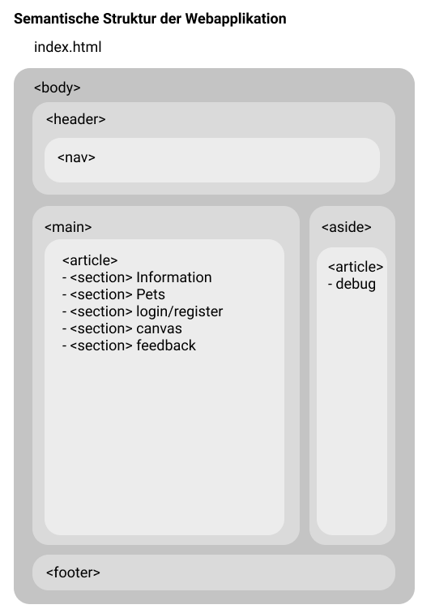

# MEP - Webt “Pet Organizer”

 
Wichtige Informationen an den Leser des Codes: In allen Source Dateien gibt es einen
Kommentar Kopf am Anfang der Datei und eine menge Kommentaren im Code selbst. 
In der Kopfzeile sowie in den Kommentaren ist beschreiben, welche Anforderung bearbeitet wurden. 
Die Anforderungen stammen aus dem Auftragsdokument 
"Web Technologien HS2020 MEP: Schriftliche Arbeit / Martin Bättig und Raphael Ritter".
Die Anforderung stelle ich jeweils in Quotes -> hier exemplarisch "Anforderung" XY...

Die History des Projekts kann auf meinem Github Profil eingesehen werden. Dort 
befindet sich das Repository mit dem Source Code.

Als "einheitliches Thema" für die MEP wurde eine “Pet Organizer Webapplikation” gewählt.
Diese besteht grundsätzlich aus den Bereichen bzw. Sektionen:

- Navigation (Responsive NAV: Links zeigen auf die anderen Sektionen)
- Information (Responsive Zweispaltig mit W3.CSS umgesetzt, Bild/Text)
- Pets (Serverseitiges Script zum hinzufügen und auflisten von Pets)
- Login / Register (Serverseitiges Script um Login abzuarbeiten)
- Canvas (mit den üblichen canvas operationen)
- Feedback (ein Formular um mir Feedback zukommen zulassen)

### Verwendete Technologien
es wurden ausschliesslich folgende Technologien verwendet:
- HTML, Javascript, CSS, W3.CSS, PHP, MySQL, AJAX
- keine zusätzlich unzulässigen Techniken/Frameworks

### Requirements
- MAMP oder XAMP (APACHE, PHP, MySQL)
- Ausführen von der Datei "shema.sql" in phpMyAdmin

### Links
Github Repository:
- https://github.com/RubenNunez/pet-organizer-webt

Konzept & Design:
- https://www.figma.com/file/N9cDAs4GuPVtH0EgzB347s/mep-webt-pet-organizer

Project Plan:
- https://app.asana.com/0/1162254960130441/list
